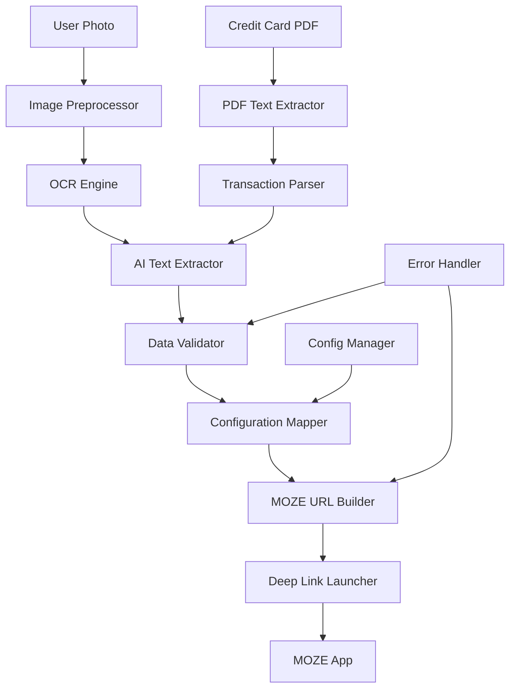

# Auto Expense Tracker - System Architecture

## Overview

The Auto Expense Tracker is a photo-to-expense automation system that processes receipt images and generates MOZE app URLs for seamless expense recording.

## System Architecture



## Data Flow

### Receipt Photo Processing
1. **Image Input** - User captures receipt photo
2. **Preprocessing** - Rotation correction, noise reduction, contrast enhancement
3. **OCR Processing** - Text extraction from image
4. **AI Analysis** - Structure extraction from raw text

### Credit Card Statement Processing
1. **PDF Input** - Bank statement file (email/download)
2. **Text Extraction** - PDF parsing with format detection
3. **Transaction Parsing** - Structured data extraction from tables
4. **AI Enhancement** - Merchant name standardization and categorization

### Common Pipeline
5. **Data Validation** - Confidence scoring and error detection
6. **Smart Mapping** - Auto-categorization using user rules
7. **URL Generation** - MOZE-compatible deep link creation
8. **Launch Integration** - Automatic app switching

## Technology Stack

### Core Components

| Component | Technology | Rationale |
|-----------|------------|-----------|
| **OCR Engine** | Google ML Kit | Cross-platform, free tier, offline capable |
| **PDF Processing** | pdfplumber + PyPDF2 | Handles both text and table extraction |
| **AI Processing** | OpenAI GPT-4o-mini | Cost-effective, structured output |
| **Image Processing** | PIL/OpenCV | Standard libraries, proven reliability |
| **Configuration** | JSON + Pydantic | Type safety, easy validation |
| **Integration** | URL Schemes | Native mobile deep linking |

### Platform Support

- **Primary**: iOS Shortcuts (rapid deployment)
- **Secondary**: Python CLI (development/testing)
- **Future**: Android Tasker, standalone apps

## Module Architecture

```
src/
├── core/
│   ├── ocr_processor.py      # Image → Text
│   ├── pdf_processor.py      # PDF → Transactions
│   ├── ai_processor.py       # Strategy Engine
│   ├── engines/              # AI Engine Implementations
│   │   ├── openai_engine.py
│   │   ├── local_engine.py
│   │   └── claude_engine.py
│   ├── moze_integrator.py    # Data → MOZE URL
│   ├── config_manager.py     # User Settings
│   └── queue_processor.py    # Async Processing
├── utils/
│   ├── image_utils.py        # Preprocessing
│   ├── pdf_utils.py          # PDF parsing utilities
│   ├── validators.py         # Data Validation + Suggestions
│   ├── confidence_mapper.py  # Field Confidence Analysis
│   └── exceptions.py         # Error Handling
├── templates/
│   └── prompts/              # AI Prompt Templates
│       ├── default.txt
│       ├── bank_statement.txt
│       └── taobao_invoice.txt
└── integrations/
    ├── shortcuts.py          # iOS Integration
    └── api_clients.py        # External APIs
```

## Key Design Decisions

### OCR Selection: Google ML Kit
- **Pros**: Free tier (1000 requests/month), cross-platform, good accuracy
- **Cons**: Cloud dependency, rate limits
- **Alternative**: Apple Vision (iOS-only but offline)

### PDF Processing Selection: pdfplumber + PyPDF2
- **pdfplumber**: Excellent table extraction, text positioning
- **PyPDF2**: Fallback for simple text extraction
- **Alternative**: Camelot (table-focused), Tabula (Java dependency)

### AI Model: Strategy Engine Pattern
**Architecture**: Plugin-based AI engine with dynamic selection

```python
class BaseAIEngine:
    def extract(self, text: str) -> Transaction: ...
    def get_confidence(self) -> float: ...

class OpenAIEngine(BaseAIEngine): ...
class LocalEngine(BaseAIEngine): ...
class ClaudeEngine(BaseAIEngine): ...

class AIProcessor:
    def __init__(self, config):
        self.engines = self._register_engines(config)
        self.strategy = config.get("strategy", "hybrid")
    
    def extract(self, text: str) -> Transaction:
        return self._select_engine(text).extract(text)
```

**Performance Comparison**:
| Engine | Speed | Accuracy | Cost | Offline |
|--------|-------|----------|------|---------|
| GPT-4o-mini | 2s | 95% | $0.02 | ❌ |
| Claude-3-haiku | 1.5s | 93% | $0.015 | ❌ |
| Phi-3-mini | 5s | 85% | Free | ✅ |
| Qwen2.5-7B | 8s | 90% | Free | ✅ |

### Architecture Patterns
- **Pipeline**: Linear processing with validation checkpoints
- **Strategy**: Pluggable OCR/AI providers
- **Observer**: Error logging and user feedback

## Data Models

### OCR Result
```python
@dataclass
class OCRResult:
    text: str
    confidence: float
    bounding_boxes: List[BoundingBox]
    processing_time: float
```

### Enhanced Validation with Smart Suggestions
```python
class EnhancedValidator:
    def validate_with_suggestions(self, transaction: Transaction) -> ValidationResult:
        result = ValidationResult()
        
        # Field-level confidence checking
        if transaction.confidence.get("date", 0) < 0.8:
            result.suggestions["date"] = self._infer_date_from_context()
        
        if transaction.confidence.get("category", 0) < 0.7:
            result.suggestions["category"] = self._suggest_category(transaction.merchant)
        
        return result

class ConfidenceMapper:
    def generate_heat_map(self, transaction: Transaction) -> Dict[str, Tuple[str, float]]:
        return {
            "merchant": [transaction.merchant, transaction.confidence.get("merchant", 0)],
            "amount": [str(transaction.amount), transaction.confidence.get("amount", 0)],
            "date": [transaction.date.isoformat(), transaction.confidence.get("date", 0)]
        }
```

### Async Processing Pipeline
```python
class QueueProcessor:
    async def process_batch(self, files: List[str]) -> List[Transaction]:
        tasks = [self._process_single(file) for file in files]
        return await asyncio.gather(*tasks)
    
    async def _process_single(self, file: str) -> Transaction:
        # Non-blocking processing
        pass
```

### MOZE URL
```python
@dataclass
class MOZETransaction:
    action: str  # "expense", "income", "transfer"
    amount: Decimal
    account: str
    subcategory: str
    optional_params: Dict[str, Any] = field(default_factory=dict)
    
    def to_url(self) -> str:
        return f"moze3://{self.action}?{urlencode(self.params)}"
```

## Configuration System

### Enhanced User Configuration
```json
{
  "accounts": {
    "Credit Card": {"type": "credit", "currency": "USD"},
    "Cash": {"type": "cash", "currency": "USD"}
  },
  "categories": {
    "Food": ["Restaurant", "Lunch", "Dinner"],
    "Transport": ["Gas", "Uber", "Parking"]
  },
  "ai_settings": {
    "strategy": "hybrid",  // "cloud", "local", "hybrid"
    "primary_engine": "openai",
    "fallback_engine": "phi-3-mini",
    "confidence_policy": {
      "amount": 0.8,
      "merchant": 0.75,
      "category": 0.7,
      "date": 0.8
    },
    "temperature": 0.1
  },
  "prompt_templates": {
    "default": "Extract amount, date, merchant from: {{TEXT}}",
    "bank_statement": "Parse bank transactions from: {{TEXT}}",
    "taobao_invoice": "Extract Chinese e-commerce data: {{TEXT}}"
  },
  "security_mode": {
    "allow_network": true,
    "allow_file_logging": false,
    "sandboxed_processing": false,
    "data_anonymization": true
  },
  "ocr_settings": {
    "provider": "google_ml_kit",
    "preprocessing": true
  }
}
```

### Smart Mapping Rules
```json
{
  "merchant_mapping": {
    "MCDONALD'S #1234": {"category": "Food", "subcategory": "Lunch"},
    "SHELL 12345": {"category": "Transport", "subcategory": "Gas"}
  },
  "keyword_rules": {
    "starbucks|coffee": {"category": "Food", "subcategory": "Coffee"},
    "uber|lyft": {"category": "Transport", "subcategory": "Rideshare"}
  }
}
```

## Error Handling Strategy

### Validation Pipeline
1. **Image Quality** - Blur detection, resolution check
2. **OCR Confidence** - Minimum threshold (0.7)
3. **Required Fields** - Amount validation mandatory
4. **MOZE Compatibility** - Account/category existence

### Fallback Mechanisms
- Manual review for low-confidence extractions
- Rule-based parsing when AI fails
- User correction learning system

## Performance Requirements

| Metric | Target | Measurement |
|--------|--------|-------------|
| **Image Processing** | <3 seconds | End-to-end pipeline |
| **OCR Accuracy** | >85% | Amount extraction |
| **AI Extraction** | >90% | Required fields |
| **URL Generation** | <100ms | MOZE link creation |

## Security Considerations

### Enhanced Data Privacy & Security
- No persistent storage of receipt images
- Local processing where possible
- API keys stored in secure keychain/keystore
- **Security isolation**: Sandbox mode for enterprise deployment
- **Data anonymization**: Auto-mask amounts/merchants in logs
- **Network controls**: Configurable offline-only mode
- **Field-level encryption**: Sensitive data protection at rest

### Error Logging
- Sanitized logs (no sensitive data)
- Optional telemetry with user consent
- Local error recovery

## Deployment Strategy

### Phase 1: iOS Shortcuts
- Rapid prototyping and user testing
- No app store approval required
- Easy configuration sharing

### Phase 2: Python Package
- Cross-platform CLI tool
- Developer-friendly installation
- Batch processing capabilities

### Phase 3: Mobile Apps
- Native iOS/Android applications
- Enhanced UI/UX
- Offline processing optimization

## Machine Learning Enhancement Strategy

### Training Data Pipeline
```python
class TrainingDataCollector:
    def collect_historical_data(self, moze_export: str) -> TrainingDataset:
        """Extract patterns from 2-month MOZE transaction history"""
        transactions = self._parse_moze_export(moze_export)
        return self._create_training_samples(transactions)
    
    def _create_training_samples(self, transactions: List[Transaction]) -> TrainingDataset:
        samples = []
        for tx in transactions:
            # Create input-output pairs for fine-tuning
            sample = {
                "input": f"Extract transaction from: {tx.raw_text}",
                "output": tx.structured_json(),
                "metadata": {"confidence": tx.user_confirmed}
            }
            samples.append(sample)
        return TrainingDataset(samples)
```

### Fine-tuning Strategy

**Approach 1: Local Model Fine-tuning**
- Base model: Phi-3-mini or Qwen2.5-3B
- Training data: Your 2-month transaction patterns
- Method: LoRA (Low-Rank Adaptation) for efficiency
- Expected improvement: 10-15% accuracy boost on your specific data patterns

**Approach 2: Few-Shot Prompt Engineering**
- Extract representative examples from your data
- Create dynamic prompt templates with your merchant/category patterns
- Embed user-specific examples in context

### Prompt Template System

```python
class PromptTemplateManager:
    def __init__(self, user_data_path: str):
        self.user_patterns = self._analyze_historical_data(user_data_path)
    
    def generate_prompt(self, text: str, source_type: str) -> str:
        base_template = self.templates[source_type]
        examples = self._get_relevant_examples(text)
        return base_template.format(
            examples=examples,
            user_merchants=self.user_patterns["frequent_merchants"],
            user_categories=self.user_patterns["category_mapping"],
            text=text
        )
```

**Template Structure**:
```
templates/prompts/personalized.txt:
You are processing expenses for a user with these patterns:

Frequent merchants: {user_merchants}
Category preferences: {user_categories}

Examples from user's history:
{examples}

Now extract from: {text}

Output JSON format: {{"amount": X, "merchant": "Y", "category": "Z"}}
```

### Implementation Plan

**Phase 1: Data Analysis** (Week 1)
- Export MOZE data for pattern analysis
- Identify frequent merchants, categories, spending patterns
- Create prompt examples from high-confidence transactions

**Phase 2: Prompt Optimization** (Week 2)
- Implement dynamic prompt generation with user examples
- A/B test against baseline prompts
- Measure accuracy improvement

**Phase 3: Fine-tuning** (Week 3-4)
- Prepare training dataset from user corrections
- Fine-tune local model using LoRA
- Evaluate performance vs prompt-based approach

### Data Requirements

**Minimum Dataset**:
- 200+ confirmed transactions
- Diverse merchant types
- User correction history
- Category distribution analysis

**Training Format**:
```json
{
  "training_samples": [
    {
      "input": "STARBUCKS STORE #1234 $8.50 06/08/2024",
      "output": {
        "amount": 8.50,
        "merchant": "Starbucks",
        "category": "Food",
        "subcategory": "Coffee",
        "date": "2024-06-08"
      },
      "confidence": 1.0
    }
  ]
}
```

## Development Guidelines

### Code Quality
- Type hints required (Python 3.8+)
- Unit tests >80% coverage
- Integration tests with sample receipts
- Automated security scanning

### Dependencies
- Minimize external dependencies
- Pin versions for reproducibility
- Regular security updates
- Offline-first design where possible
